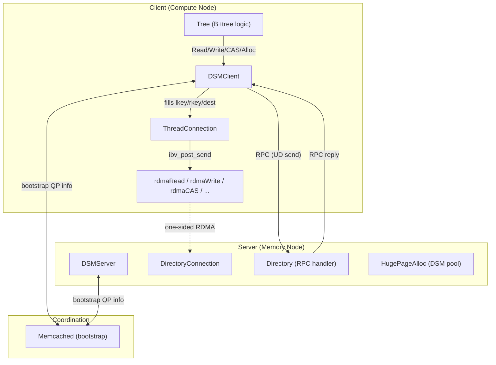

# Porting Deft's Communication Layer: RDMA → Simulated CXL

## Background & Problem

Deft is a B+tree index on disaggregated memory. The current communication layer is built entirely on RDMA (ibverbs). The goal is to add a **simulated CXL** backend so the same B+tree logic can run over either transport, selected at **compile time** via a macro (`-DUSE_CXL` vs `-DUSE_RDMA`). This enables direct A/B performance comparison between RDMA and CXL-style load/store access.

## Architecture Analysis

### Current RDMA Data Flow



### Key Layers (Bottom → Top)

| Layer | Files | RDMA Coupling |
|-------|-------|---------------|
| **Raw RDMA verbs** | `src/rdma/Operation.cpp`, `Resource.cpp`, `StateTrans.cpp`, `Utility.cpp`, `include/Rdma.h` | 100% — `ibv_*` calls |
| **Connection structs** | `ThreadConnection.{h,cpp}`, `DirectoryConnection.{h,cpp}`, `connection.h`, `AbstractMessageConnection.{h,cpp}`, `RawMessageConnection.{h,cpp}` | ~95% — `ibv_qp*`, `ibv_mr*`, `ibv_cq*`, `ibv_ah*` everywhere |
| **Keeper / Bootstrap** | `dsm_keeper.{h,cpp}` | ~60% — exchanges QP numbers, rkeys, lids via memcached |
| **DSM Client/Server** | `dsm_client.{h,cpp}`, `dsm_server.{h,cpp}` | High — wraps RDMA ops, manages connections, does RPC via UD |
| **Tree** | `Tree.{h,cpp}` | **Zero direct RDMA** — calls only `DSMClient::Read/Write/CAS/...` |

> [!IMPORTANT]
> The Tree layer is **completely transport-agnostic** — it only calls `DSMClient` methods. This is the key insight: we only need to provide an alternative `DSMClient` + `DSMServer` implementation for CXL. The Tree code does not change.

### What "Simulated CXL" Means

CXL (Compute Express Link) provides cache-coherent shared memory between host and attached memory devices. The simplest simulation is:

- **Shared memory region** (e.g., `mmap` of a file in `/dev/shm` or a DAX filesystem) that both "server" and "client" processes map into their address space.
- **Data-plane operations** (`Read`, `Write`, `CAS`) become **direct load/store/atomic** on the shared region — no network, no verbs.
- **Control-plane RPC** (malloc, new_root, terminate) uses a simple shared-memory message queue instead of RDMA UD sends.
- **No QP setup, no rkey/lkey, no CQ polling** — the entire ibverbs stack is bypassed.

This works because both processes run on the **same physical machine** (or NUMA nodes), which is the typical CXL evaluation setup.

---

## Proposed Changes

### Phase 0: Build System — Compile Macro

#### [MODIFY] [CMakeLists.txt](file:///home/yaz/_dev/deft/CMakeLists.txt)

Add an `option()` for selecting the transport backend:

```cmake
option(USE_CXL "Build with simulated CXL backend instead of RDMA" OFF)

if(USE_CXL)
  add_definitions(-DUSE_CXL)
  # No ibverbs/rdma link flags needed
  set(LINKS_FLAGS "-lcityhash -lboost_system -lboost_coroutine -lpthread -lmemcached -lgflags -lrt")
else()
  add_definitions(-DUSE_RDMA)
  # Existing RDMA link flags
  set(LINKS_FLAGS "-lcityhash -lboost_system -lboost_coroutine -lpthread -libverbs -lmemcached -lgflags")
endif()
```

The source file glob picks up everything in `src/`, so we'll use `#ifdef USE_CXL` / `#ifdef USE_RDMA` guards inside the files, **not** separate source directories. This keeps the diff small and avoids CMake complexity.

> [!NOTE]
> `-lrt` is added for CXL mode because `shm_open()` requires it on Linux.

---

### Phase 1: CXL Shared Memory Transport Layer

#### [NEW] [include/CxlTransport.h](file:///home/yaz/_dev/deft/include/CxlTransport.h)

The core CXL shared-memory abstraction. Replaces the entire RDMA verbs layer.

```
namespace cxl {

// Shared memory region descriptor
struct SharedRegion {
    std::string shm_name;    // /dev/shm name
    void*       base_addr;   // mmap'd base
    uint64_t    size;
    int         fd;          // shm fd
};

// Create and map a shared memory region (server calls this)
SharedRegion create_region(const std::string& name, uint64_t size);

// Open and map an existing shared memory region (client calls this)
SharedRegion open_region(const std::string& name, uint64_t size);

// Close and unmap
void close_region(SharedRegion& region);

// CXL "data plane" — direct load/store on shared memory
// These intentionally mirror DSMClient's API semantics:
void read(void* local_buf, void* remote_addr, size_t size);
void write(const void* local_buf, void* remote_addr, size_t size);
bool cas(void* remote_addr, uint64_t expected, uint64_t desired, uint64_t* old_val);
uint64_t fetch_and_add(void* remote_addr, uint64_t add_val);

// CXL "message queue" for RPC (replaces RDMA UD send/recv)
// A simple lock-free SPSC or MPSC queue in shared memory
struct MessageSlot {
    std::atomic<uint8_t> valid;  // 0 = empty, 1 = request, 2 = reply
    RawMessage msg;
    char padding[...];           // cache-line aligned
};

struct MessageQueue {
    void*     base;
    uint32_t  capacity;
    std::atomic<uint32_t> head;
    std::atomic<uint32_t> tail;
};

} // namespace cxl
```

#### [NEW] [src/cxl/CxlTransport.cpp](file:///home/yaz/_dev/deft/src/cxl/CxlTransport.cpp)

Implementation:
- `create_region()`: `shm_open` + `ftruncate` + `mmap` with `MAP_SHARED`
- `open_region()`: `shm_open` (O_RDWR, no O_CREAT) + `mmap` with `MAP_SHARED`
- `read()` / `write()`: `memcpy` with `mfence` barriers
- `cas()`: `__atomic_compare_exchange_n` (or `std::atomic` reinterpret)
- `fetch_and_add()`: `__atomic_fetch_add`
- Message queue: spin-based MPSC queue in the shared region itself

> [!TIP]
> We use `memcpy` + `mfence` rather than raw loads to closely simulate CXL's cache-line-granularity behavior and ensure correct ordering semantics.

---

### Phase 2: CXL DSM Server Implementation

#### [MODIFY] [include/dsm_server.h](file:///home/yaz/_dev/deft/include/dsm_server.h)

```cpp
#ifdef USE_CXL
  // Replace RDMA-specific members with CXL equivalents
  cxl::SharedRegion dsm_region_;      // the main disaggregated memory pool
  cxl::SharedRegion lock_region_;     // on-chip lock memory equivalent
  cxl::SharedRegion rpc_region_;      // RPC message queue region
  
  void InitCxlMemory();              // replaces InitRdmaConnection()
#else
  // existing RDMA members unchanged
  DSMServerKeeper *keeper_;
  RemoteConnectionToClient *conn_to_client_;
  DirectoryConnection *dir_con_[NR_DIRECTORY];
  ...
  void InitRdmaConnection();
#endif
```

#### [MODIFY] [src/dsm_server.cpp](file:///home/yaz/_dev/deft/src/dsm_server.cpp)

Under `#ifdef USE_CXL`:
- `InitCxlMemory()`:
  1. Allocate the DSM pool via `hugePageAlloc` (same as today)
  2. Call `cxl::create_region("deft_dsm", dsm_size)` to also expose it via shared memory
  3. Create `cxl::create_region("deft_lock", lock_size)` for lock memory
  4. Create `cxl::create_region("deft_rpc", rpc_size)` for the RPC message queues
  5. Publish the shm names + base addresses via memcached (clients look them up)
- `Run()`: poll the shared-memory RPC queue instead of `ibv_poll_cq`, dispatch to `Directory::process_message`

Under `#else` (USE_RDMA): existing code, unchanged.

---

### Phase 3: CXL DSM Client Implementation

#### [MODIFY] [include/dsm_client.h](file:///home/yaz/_dev/deft/include/dsm_client.h)

```cpp
#ifdef USE_CXL
  cxl::SharedRegion dsm_region_;
  cxl::SharedRegion lock_region_;
  cxl::SharedRegion rpc_region_;
  
  void InitCxlConnection();   // replaces InitRdmaConnection()
  
  // Internal: translate GlobalAddress → raw pointer in the mmap'd region
  void* ResolveAddr(GlobalAddress gaddr);
  void* ResolveLockAddr(GlobalAddress gaddr);
#else
  // existing RDMA members
  RemoteConnectionToServer *conn_to_server_;
  ThreadConnection *th_con_[MAX_APP_THREAD];
  DSMClientKeeper *keeper_;
  ...
  void InitRdmaConnection();
#endif
```

#### [MODIFY] [src/dsm_client.cpp](file:///home/yaz/_dev/deft/src/dsm_client.cpp)

This is the **biggest change**. Every DSM operation gets a CXL branch. For example:

```cpp
void DSMClient::ReadSync(char *buffer, GlobalAddress gaddr, size_t size,
                         CoroContext *ctx) {
#ifdef USE_CXL
  void* remote = ResolveAddr(gaddr);
  cxl::read(buffer, remote, size);
  // No completion polling needed — it's a memcpy, it's done
#else
  Read(buffer, gaddr, size, true, ctx);
  if (ctx == nullptr) {
    ibv_wc wc;
    pollWithCQ(i_con_->cq, 1, &wc);
  }
#endif
}

bool DSMClient::CasSync(GlobalAddress gaddr, uint64_t equal, uint64_t val,
                        uint64_t *rdma_buffer, CoroContext *ctx) {
#ifdef USE_CXL
  void* remote = ResolveAddr(gaddr);
  return cxl::cas(remote, equal, val, rdma_buffer);
#else
  // existing RDMA code
#endif
}
```

Key operations to implement under CXL:

| DSMClient Method | CXL Implementation |
|---|---|
| `Read` / `ReadSync` | `memcpy(local, remote, size)` + `mfence` |
| `Write` / `WriteSync` | `memcpy(remote, local, size)` + `mfence` |
| `Cas` / `CasSync` | `__atomic_compare_exchange_n` |
| `CasMask` / `CasMaskSync` | Software CAS loop with masking |
| `FaaBound` / `FaaBoundSync` | `__atomic_fetch_add` with boundary logic |
| `ReadBatch` / `WriteBatch` | Loop of individual `memcpy` calls |
| `CasRead`, `WriteCas`, etc. | Sequential atomic + memcpy (no WR chaining needed) |
| `ReadDm` / `WriteDm` / `CasDm` | Same as regular versions (lock memory is also mmap'd) |
| `PollRdmaCq` | No-op (operations are synchronous) |
| `Alloc` / `Free` | RPC via shared-memory message queue |
| `RpcCallDir` / `RpcWait` | Write to shared-memory queue, spin-wait for reply |

> [!IMPORTANT]
> **Coroutine support**: Under CXL, all operations complete synchronously (no network latency to hide). The `CoroContext` parameter will be accepted but ignored — no yield needed. The `signal` parameter is also irrelevant. This means coroutine-based benchmarks will still run but won't benefit from coroutine concurrency under CXL.

#### `ResolveAddr` Implementation

```cpp
void* DSMClient::ResolveAddr(GlobalAddress gaddr) {
    // In single-server CXL mode, nodeID is always 0
    // offset maps directly into the mmap'd shared region
    return (char*)dsm_region_.base_addr + gaddr.offset;
}
```

---

### Phase 4: Connection/Bootstrap Layer Adjustments

#### [MODIFY] [include/connection.h](file:///home/yaz/_dev/deft/include/connection.h)

Wrap the existing structs with `#ifdef USE_RDMA`:

```cpp
#ifdef USE_RDMA
struct RemoteConnectionToClient { ... };  // unchanged
struct RemoteConnectionToServer { ... };  // unchanged
#else
// Minimal stubs or empty structs for CXL
struct RemoteConnectionToClient {};
struct RemoteConnectionToServer {};
#endif
```

#### [MODIFY] [include/Common.h](file:///home/yaz/_dev/deft/include/Common.h)

Guard the `#include "Rdma.h"` and ibverbs-dependent code:

```cpp
#ifdef USE_RDMA
#include "Rdma.h"
#else
#include "CxlTransport.h"
#endif
```

Also need to guard `RdmaOpRegion` usage or provide a compatible CXL definition.

#### [MODIFY] [include/Rdma.h](file:///home/yaz/_dev/deft/include/Rdma.h)

Wrap the entire file with `#ifdef USE_RDMA` so it's excluded from CXL builds:

```cpp
#ifdef USE_RDMA
// ... existing content ...
#endif
```

Similarly for all files in `src/rdma/`.

#### [MODIFY] [include/ThreadConnection.h](file:///home/yaz/_dev/deft/include/ThreadConnection.h) + [DirectoryConnection.h](file:///home/yaz/_dev/deft/include/DirectoryConnection.h)

Wrap with `#ifdef USE_RDMA` — these structs are RDMA-specific and not needed under CXL.

#### [MODIFY] [include/dsm_keeper.h](file:///home/yaz/_dev/deft/include/dsm_keeper.h)

- The `Keeper` base class (memcached operations, `Barrier`, `Sum`) is **transport-agnostic** and stays.
- `DSMServerKeeper` and `DSMClientKeeper` are heavily RDMA-coupled (exchange QP numbers, rkeys, etc.). Wrap them with `#ifdef USE_RDMA`.
- Under `#ifdef USE_CXL`, provide simpler keeper classes that only exchange shared-memory region names/sizes via memcached.

#### [MODIFY] [include/AbstractMessageConnection.h](file:///home/yaz/_dev/deft/include/AbstractMessageConnection.h) + [RawMessageConnection.h](file:///home/yaz/_dev/deft/include/RawMessageConnection.h)

Wrap with `#ifdef USE_RDMA`. Under CXL, `RawMessage` struct is still needed (for `Directory::process_message`), but the connection classes are not.

#### [MODIFY] [include/RdmaBuffer.h](file:///home/yaz/_dev/deft/include/RdmaBuffer.h)

Under CXL, `RdmaBuffer` is still useful as a thread-local scratch buffer manager (the Tree uses `get_cas_buffer()`, `get_page_buffer()` etc.). Keep it as-is but remove the name confusion — it's just a buffer pool.

---

### Phase 5: Handling Remaining ibverbs Type Leakage

Several headers and the `DSMClient` public interface use ibverbs types (`RdmaOpRegion`, `ibv_wc`, etc.). Under CXL:

#### `RdmaOpRegion`

This struct is used in batch operations (`ReadBatch`, `WriteBatch`, `CasRead`, etc.). Under CXL, we still need the `source` (local address), `dest` (remote GlobalAddress), and `size` fields. Options:

- **Option A (recommended)**: Keep `RdmaOpRegion` definition but guard the RDMA-specific fields:
  ```cpp
  struct RdmaOpRegion {
    uint64_t source;
    uint64_t dest;
    union {
      uint64_t size;
      uint64_t log_sz;
    };
  #ifdef USE_RDMA
    uint32_t lkey;
    union {
      uint32_t remoteRKey;
      bool is_on_chip;
    };
  #else
    bool is_on_chip = false;
  #endif
  };
  ```

#### `ibv_wc` in public API

`PollRdmaCq` returns `ibv_wc` info. Under CXL, this becomes a no-op returning success. Guard with `#ifdef USE_RDMA`.

---

### Phase 6: Test/Benchmark Adjustments

#### [MODIFY] [test/server.cpp](file:///home/yaz/_dev/deft/test/server.cpp)

Under CXL, the server still instantiates `DSMServer` and calls `Run()` — the internal init path changes but the API is the same. No code change needed in the test files themselves (the `#ifdef` is inside DSMServer/DSMClient).

#### [MODIFY] [test/client.cpp](file:///home/yaz/_dev/deft/test/client.cpp)

Same — the client still calls `DSMClient::GetInstance()`, `RegisterThread()`, creates a `Tree`, and runs benchmarks. No change needed.

> [!NOTE]
> For CXL testing, you run both `server` and `client` on the **same machine** (they share `/dev/shm`). RDMA testing requires two machines as before.

---

## Open Questions

> [!IMPORTANT]
> **Q1: Single-server only?** CXL naturally maps to a single memory node. Should we restrict CXL mode to `num_server = 1`, or do you want to simulate multi-node CXL (e.g., multiple shared-memory regions)? Multi-node adds complexity. I recommend starting with single-server.

> [!IMPORTANT]
> **Q2: Lock memory (on-chip DM)?** Under RDMA, Deft uses Mellanox device memory for on-chip locks. Under CXL, should we:
> - **(a)** Map a separate small shared region for locks (simple, recommended), or
> - **(b)** Add artificial latency to simulate device-memory vs. host-memory access time differences?

> [!IMPORTANT]
> **Q3: Coroutine behavior?** Under CXL, all operations are synchronous (no network latency). Coroutines won't yield. This means `USE_CORO` benchmarks will effectively run sequentially. Is this the desired behavior, or would you like to inject artificial delays to simulate CXL latency and preserve coroutine scheduling effects?

> [!IMPORTANT]  
> **Q4: `RdmaOpRegion` refactor scope?** The `RdmaOpRegion` type name is baked into `DSMClient`'s public API (batch operations). Should I:
> - **(a)** Keep the name `RdmaOpRegion` with `#ifdef` guards on the RDMA-only fields (minimal diff), or
> - **(b)** Rename it to something transport-neutral like `OpRegion` (cleaner but larger diff)?

---

## Verification Plan

### Build Verification
```bash
# Build RDMA mode (default — must still compile)
mkdir -p build_rdma && cd build_rdma
cmake .. -DUSE_CXL=OFF && make -j$(nproc)

# Build CXL mode
mkdir -p build_cxl && cd build_cxl
cmake .. -DUSE_CXL=ON && make -j$(nproc)
```

### Functional Testing (CXL mode, single machine)
```bash
# Terminal 1: start memory server
cd build_cxl && ./server --server_count=1 --client_count=1

# Terminal 2: start compute client
cd build_cxl && ./client --server_count=1 --client_count=1 \
    --num_prefill_threads=1 --num_bench_threads=1 \
    --key_space=1000000 --ops_per_thread=1000000
```

Verify: successful prefill, benchmark completes, throughput reported.

### Regression Testing (RDMA mode)
Run existing RDMA tests on CloudLab to confirm no regressions from `#ifdef` guards.

### Performance Comparison
Run both modes with identical parameters and compare:
- Throughput (Mops/s)
- Latency (µs) — avg and p99
- Cache hit rate

---

## Summary of Files Changed

| Action | File | Effort |
|--------|------|--------|
| **NEW** | `include/CxlTransport.h` | Medium |
| **NEW** | `src/cxl/CxlTransport.cpp` | Medium |
| MODIFY | `CMakeLists.txt` | Small |
| MODIFY | `include/Common.h` | Small |
| MODIFY | `include/Rdma.h` | Small (wrap in `#ifdef`) |
| MODIFY | `include/connection.h` | Small |
| MODIFY | `include/dsm_client.h` | Medium |
| MODIFY | `include/dsm_server.h` | Medium |
| MODIFY | `include/dsm_keeper.h` | Medium |
| MODIFY | `include/ThreadConnection.h` | Small |
| MODIFY | `include/DirectoryConnection.h` | Small |
| MODIFY | `include/AbstractMessageConnection.h` | Small |
| MODIFY | `include/RawMessageConnection.h` | Small |
| MODIFY | `src/dsm_client.cpp` | **Large** (core work) |
| MODIFY | `src/dsm_server.cpp` | Medium |
| MODIFY | `src/dsm_keeper.cpp` | Medium |
| MODIFY | `src/ThreadConnection.cpp` | Small (wrap in `#ifdef`) |
| MODIFY | `src/DirectoryConnection.cpp` | Small (wrap in `#ifdef`) |
| MODIFY | `src/AbstractMessageConnection.cpp` | Small (wrap in `#ifdef`) |
| MODIFY | `src/RawMessageConnection.cpp` | Small (wrap in `#ifdef`) |
| MODIFY | `src/rdma/*.cpp` | Small (wrap in `#ifdef`) |
| UNCHANGED | `include/Tree.h`, `src/Tree.cpp` | None |
| UNCHANGED | `test/client.cpp`, `test/server.cpp` | None |
